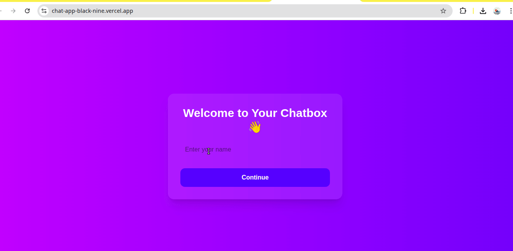
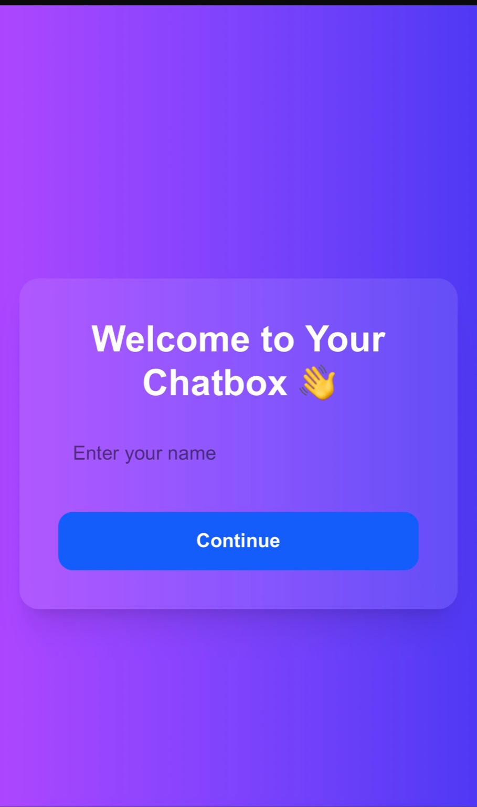
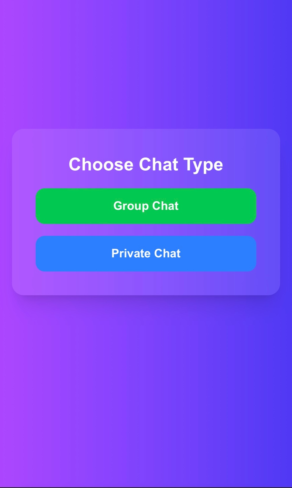
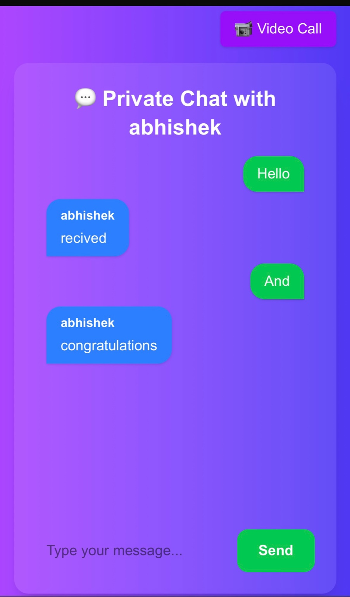

<div align="center">


[](https://nextjs.org/)
[](https://www.typescriptlang.org/)
[](https://socket.io/)
[](https://webrtc.org/)
[](https://nodejs.org/)

> **Full-stack real-time chat with peer-to-peer video calling — built with WebSockets and WebRTC**

[🚀 Live Demo](#) · [🐛 Report Bug](https://github.com/Abhishek-jaswal/chat-video-app/issues) · [✨ Request Feature](https://github.com/Abhishek-jaswal/chat-video-app/issues)

</div>

---

## ✨ Features

| Feature | Description |
|---|---|
| 🗨️ **Group Chat** | Real-time messaging across all connected users |
| 🔒 **Private Chat** | One-to-one messaging with a friend request system |
| 👥 **Live Online Users** | See who's online in real-time |
| 📹 **Video Calling** | Peer-to-peer video calls via WebRTC |
| 🔔 **Call Notifications** | Accept / Decline incoming call alerts |
| 🌐 **ICE Candidate Exchange** | Smart media routing for stable connections |

---

## 🖼️ Preview

<div align="center">

### 📹 Video Calling


### 🗨️ Chat Interface


### 🔒 Private Chat


### 👥 Group Chat


</div>

---

## 🛠️ Tech Stack

```
Frontend     → Next.js · React · TypeScript
Backend      → Node.js · Express · Socket.IO
Video        → WebRTC · ICE Candidate Exchange
Real-time    → WebSockets (Socket.IO)
```

---

## 🏗️ Project Structure

```
chat-video-app/
├── client/                   # Next.js Frontend
│   ├── components/           # Reusable UI components
│   ├── pages/                # App routes
│   └── socket.ts             # Socket.IO client setup
│
├── server/                   # Node.js Backend
│   └── index.js              # Socket.IO + WebRTC signaling server
│
└── README.md
```

---

## ⚙️ Getting Started

### Prerequisites

- Node.js `v18+`
- npm or yarn

### 1. Clone the repository

```bash
git clone https://github.com/Abhishek-jaswal/chat-video-app.git
cd chat-video-app
```

### 2. Install dependencies

```bash
# Install server dependencies
cd server && npm install

# Install client dependencies
cd ../client && npm install
```

### 3. Run the app

```bash
# Terminal 1 — Start the WebSocket server
cd server
node index.js

# Terminal 2 — Start the Next.js frontend
cd client
npm run dev
```

### 4. Open in browser

```
http://localhost:3000
```

> 💡 Open in **two browser windows** to test chat and video calling between users.

---

## 🔭 How It Works

```
User A                  Signaling Server               User B
  |                      (Socket.IO)                     |
  |──── offer ─────────────────────────────────────────► |
  |                                                       |
  | ◄─── answer ─────────────────────────────────────── |
  |                                                       |
  |──── ICE candidates ──────────────────────────────► |
  |                                                       |
  |◄════════════ P2P Video Stream (WebRTC) ════════════► |
```

The signaling server handles the WebRTC handshake — once connected, video streams directly peer-to-peer with no server in the middle.

---

## 🛣️ Roadmap

- [ ] User authentication (JWT)
- [ ] Persistent message history (PostgreSQL)
- [ ] Group video calling
- [ ] File & image sharing
- [ ] Mobile responsive UI improvements
- [ ] Deployable Docker setup

---

## 👨‍💻 Author

**Abhishek Jaswal**

[](https://abhishek-jaswal.vercel.app/)
[](https://linkedin.com/in/abhishekjaswall)
[](https://github.com/Abhishek-jaswal)

---

<div align="center">

⭐ **If you found this useful, give it a star!** ⭐


</div>
